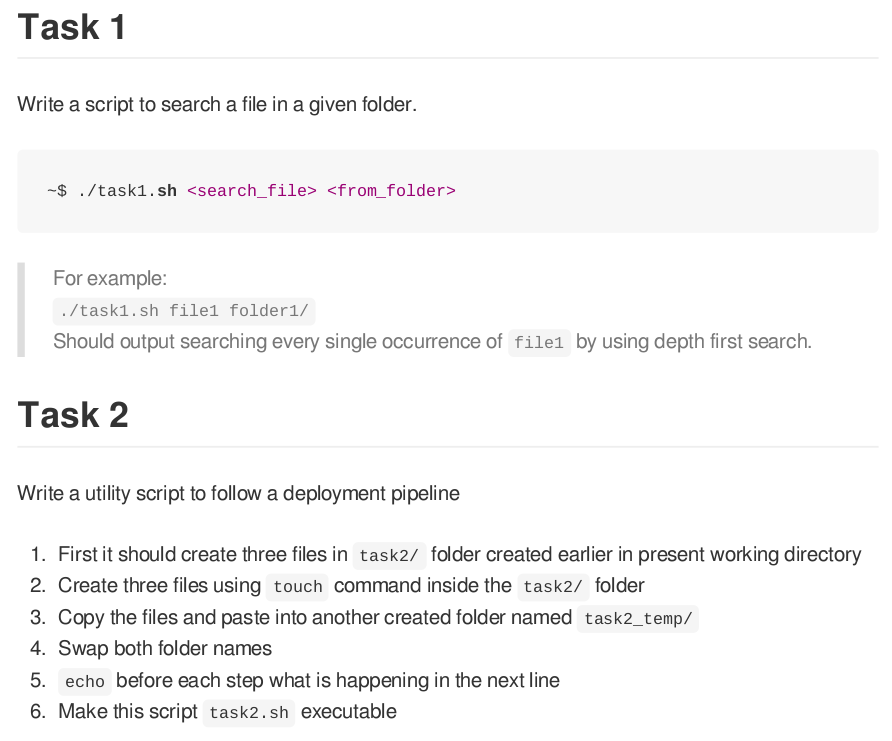
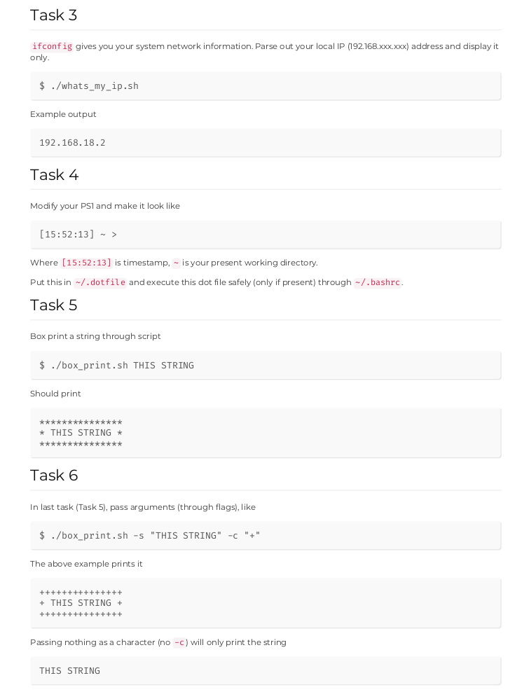

# Bash_Assignment

This Repository has 6 Tasks i.e:

- Write a script to search a file in a given folder by using depth first search.
- Write a utility script to follow a deployment pipeline
  - First it should create three files in task2/ folder created earlier in present working directory
  - Create three files using touch command inside the task2/ folder
  - Copy the files and paste into another created folder named task2_temp/
  - Swap both folder names
  - echo before each step what is happening in the next line
  - Make this script task2.sh executable
- ifconfig gives you your system network information. Parse out your local IP (192.168.xxx.xxx) address and display it
  only.
- Modify your PS1 and make it look like ""[15:52:13] ~ >""
- Box print a string through script

## Assignment

